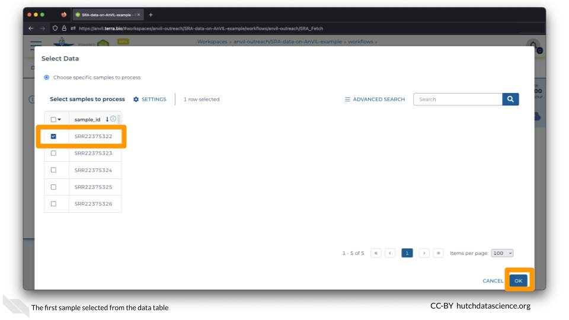
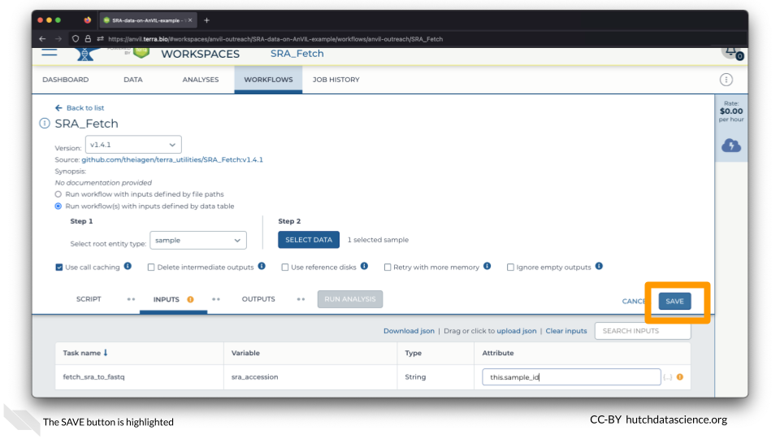
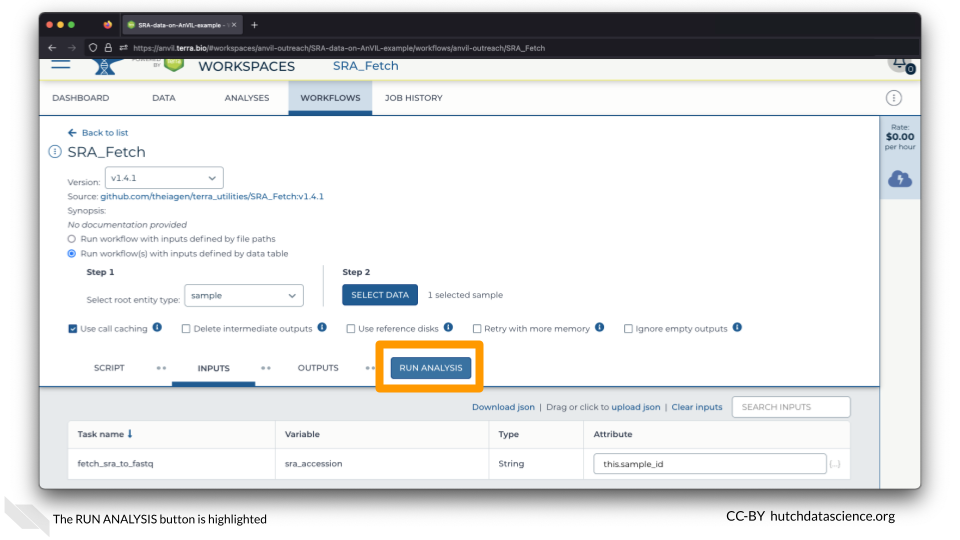
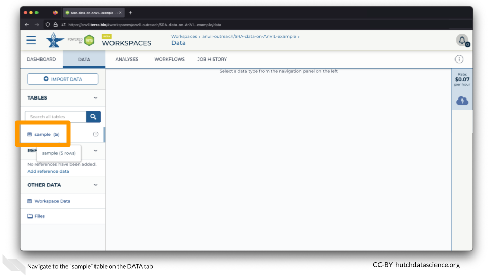

# (PART\*) SRA ON AnVIL {-}

# Quick Start {#quick-start}

In this module, we'll bring some metagenomic data into AnVIL.

This data comes from [this BioProject](https://www.ncbi.nlm.nih.gov/bioproject/PRJNA904247), which collected soil samples to study bacterial communities in tallgrass prairie. Bacteria play an important role in this ecosystem, but can be changed by disturbance, management, and the presence of herbivores.

The SRA Data corresponding to this project is located [here](https://www.ncbi.nlm.nih.gov/Traces/study/?acc=SRP409181&o=acc_s%3Aa).

::: {.dictionary}
You might hear new terms for moving data around in the cloud. **Ingress** is when data comes to you, similar to downloading a file or receiving an email with an attachment. **Egress** is sending the data to another resource, similar to uploading or sending an attached file via email. There is no fee for ingressing data to AnVIL from SRA.
:::

## Clone Workspace

Clone the Workspace `https://anvil.terra.bio/#workspaces/anvil-outreach/SRA-data-on-AnVIL`.

For this demo, we have given the cloned Workspace the name `SRA-data-on-AnVIL-example`.

## Set Up Samples

Navigate to the WORKFLOWS Tab and select the SRA_Fetch Workflow.

Select "Run workflow(s) with inputs defined by data table".

Set the "Select root entity type" to "sample" and click SELECT DATA.

On the Select Data popup, select only the first sample, `SRR22375322`, and click OK.

## Launch Workflow

Click on the space underneath "Attribute" and select `this.sample_id`.

Click SAVE.

You are ready to launch the Workflow! Click RUN ANALYSIS.

Voilà! Your Workflow is running. 

::: {.notice}
Because the Workflow is happening in the cloud, you can close your browser or shut down your computer without interrupting the transfer.
:::

## Check Workflow

Click on the JOB HISTORY tab. You should see that the job status is "Done". This might take a few minutes.

## Locate Data

Click on the DATA tab and click on the "sample" table on the left.

You should now see the file associated with the first sample!

## Summary

- Clone [Workspace](https://anvil.terra.bio/#workspaces/anvil-outreach/SRA-data-on-AnVIL)
- Go to the WORKFLOWS tab
- Select sample via data table ("Run workflow(s) with inputs defined by data table")
- Set the Attribute to `this.sample_id`
- SAVE and RUN ANALYSIS
- Go to DATA tab and click "sample" table to see file populated
