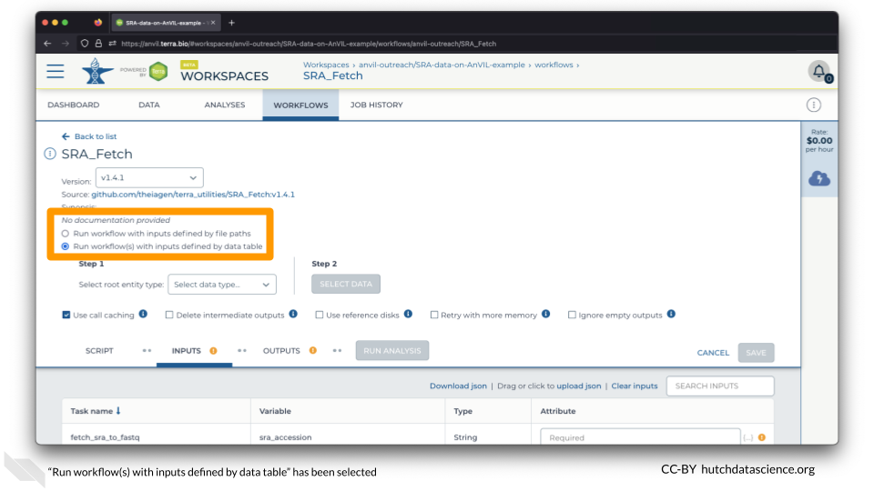
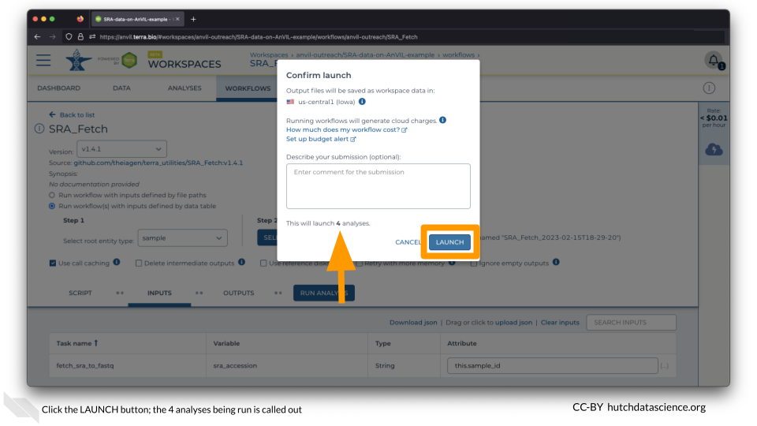
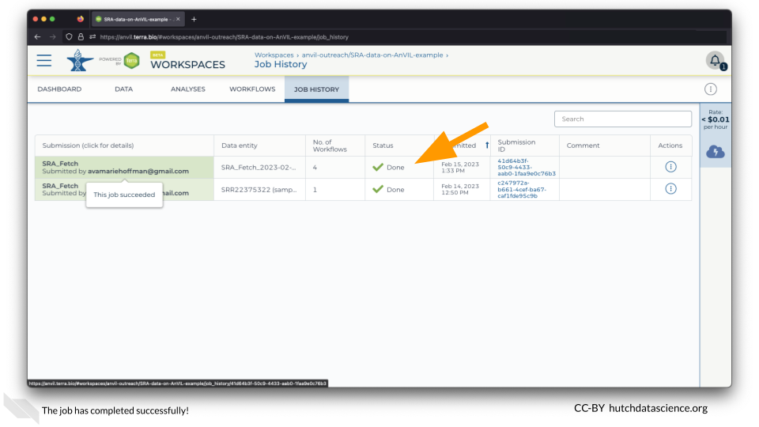

# Multiple SRA files {#multiple-sra-files}

More than likely, you will be importing multiple files from SRA. Luckily, this is quite easy in AnVIL! In contrast to how your local computer works, The SRA Fetch Workflow imports files in parallel, so it does not take a substantially longer time.

## Select Workflow Data

Navigate to the WORKFLOWS Tab and select the SRA_Fetch Workflow.

Select "Run workflow(s) with inputs defined by data table".

Set the "Select root entity type" to "sample" and click SELECT DATA.

Select the second through fifth samples and click OK on the bottom right.

Ensure the "Attribute" is set to `this.sample_id` and click RUN ANALYSIS.

Click LAUNCH. You can close your browser or shut down your computer without interrupting the transfer.

::: {.notice}
The Workflow knows that you probably want to parallelize the import of your SRA files. This means that each import is happening at the same time. Notice how this workflow with multiple samples actually launched 4 different jobs/analyses! This means that AnVIL can help you process lots of files much faster than working with them one by one.
:::

## Check Workflow

Click on the JOB HISTORY tab. Different submissions are arranged by newest on the top. You should see that the job status is "Done".

## Locate Data

Click on the DATA tab and click on the "sample" table on the left.

You should now see the files associated with the second through fifth sample!

## Summary

- Go to the WORKFLOWS tab
- Select **multiple** samples via data table ("Run workflow(s) with inputs defined by data table")
- Set the Attribute to `this.sample_id`
- SAVE and RUN ANALYSIS
- Go to DATA tab and click "sample" table to see files populated
