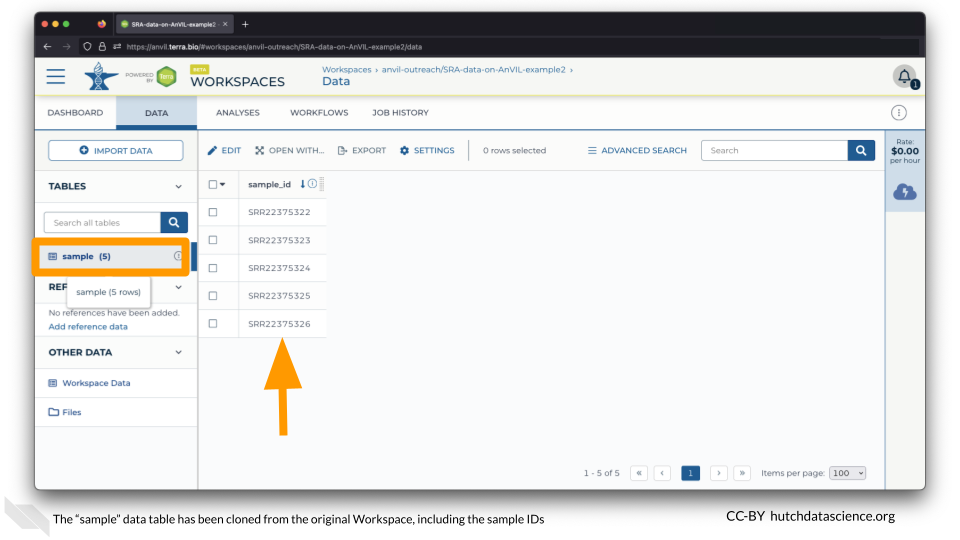
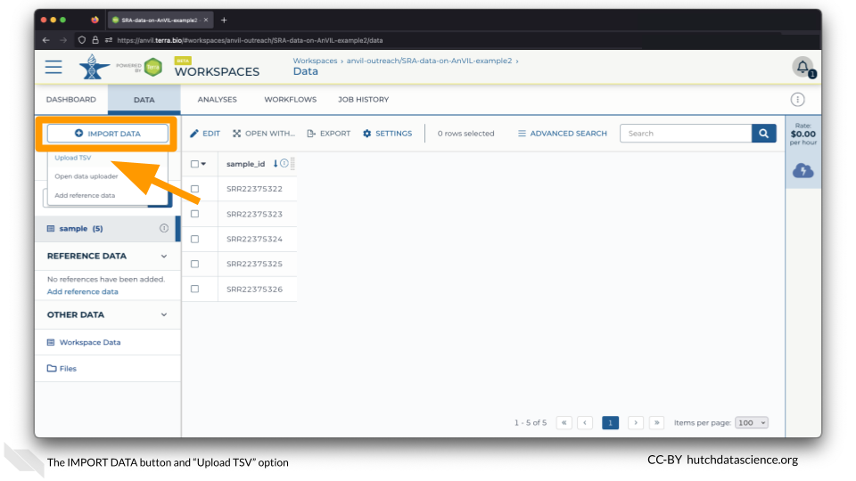
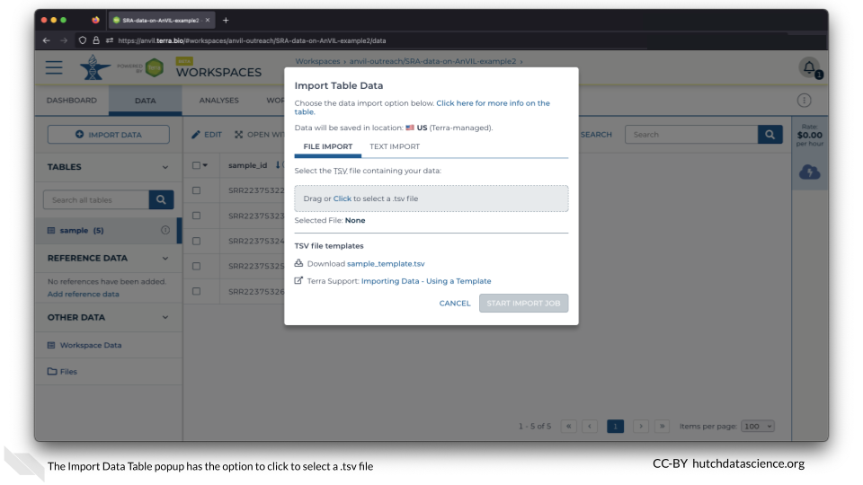
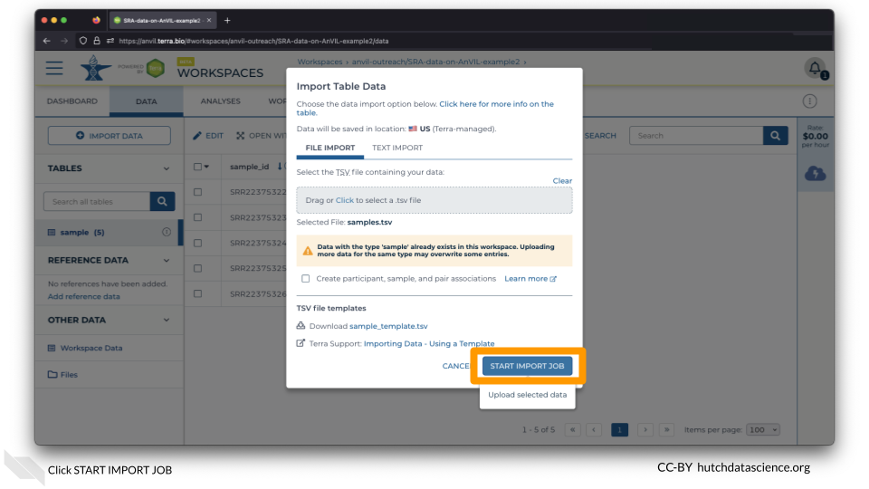
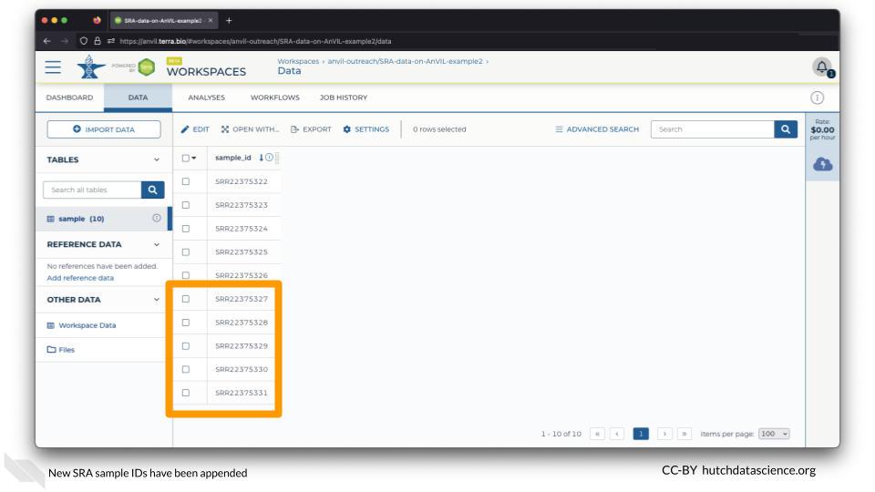

# Customize Samples

You will probably need to select different samples than the ones in this demo. 

We've created another workspace, `SRA-data-on-AnVIL-example2`, to demonstrate how to upload your own sample IDs.

If you go to the DATA tab, you'll notice the same samples (ending in 22-26). These are here because data tables are copied when you clone a workspace. However, let's add a second set of samples ending in 27-31.

## Import Data

Click on IMPORT DATA and select "Upload TSV".

This opens a popup that looks like this:

However, let's take a moment to get acquainted with the new file we'll be uploading.

## The `samples.tsv` File

First, download the samples file here. You might have to right-click and "Save as".

[Download `samples.tsv`](https://raw.githubusercontent.com/fhdsl/AnVIL_SRA_Data/main/samples.tsv)

Next, open the file on your local machine. This is what it might look like in Microsoft Excel:

::: {.notice}
The column header `entity:sample_id` is important. `entity:` is required. `samples` becomes the name of the data table. So for example, if our header was `entity:reference_id`, a data table called "reference" would be created in AnVIL. If you didn't want to overwrite anything in the original "samples" table, you could change the column header. As long as none of the IDs are the same, no data will be overwritten. 
:::

## Upload the TSV

Back on AnVIL, Click to select a TSV file. This file should be the one you just downloaded above called `samples.tsv`. You will see a warning about potentially overwriting the existing entries. We know that none of the IDs in the new samples file overlap, so click START IMPORT JOB.

New samples have been added!

::: {.notice}
You can now proceed with running the Workflow as you did in the [Quick Start](#quick-start) and [Multiple Files](#multiple-sra-files) sections.
:::

## Summary

- Go to the DATA tab
- Select IMPORT DATA and "Upload TSV"
- Add your custom file and click START IMPORT JOB
